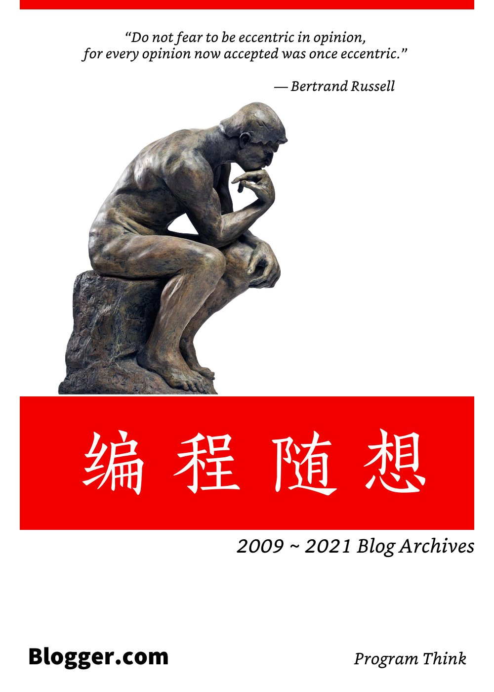
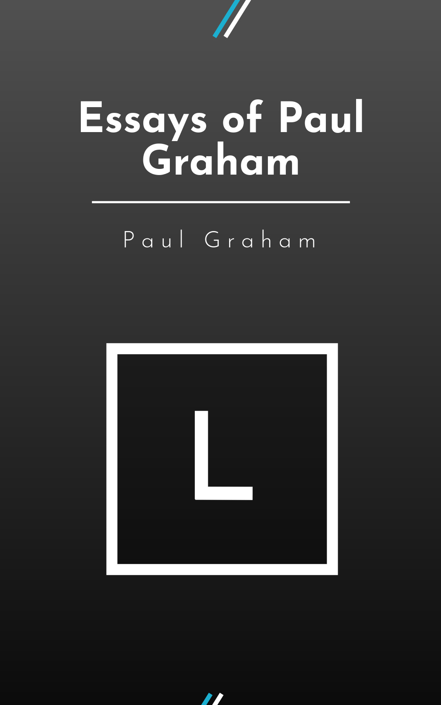
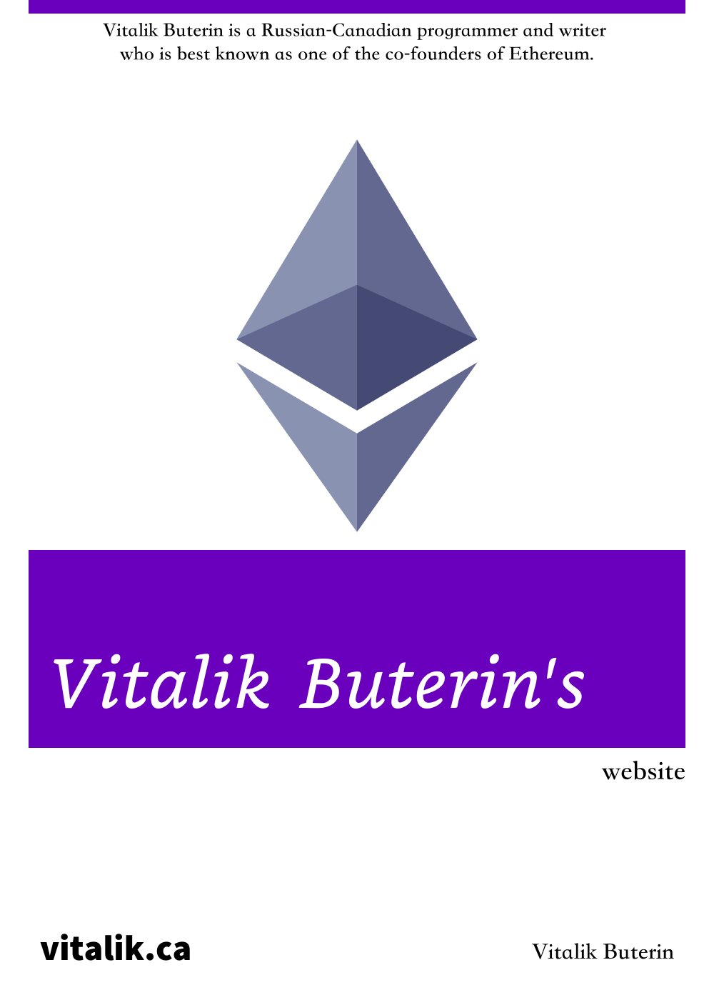
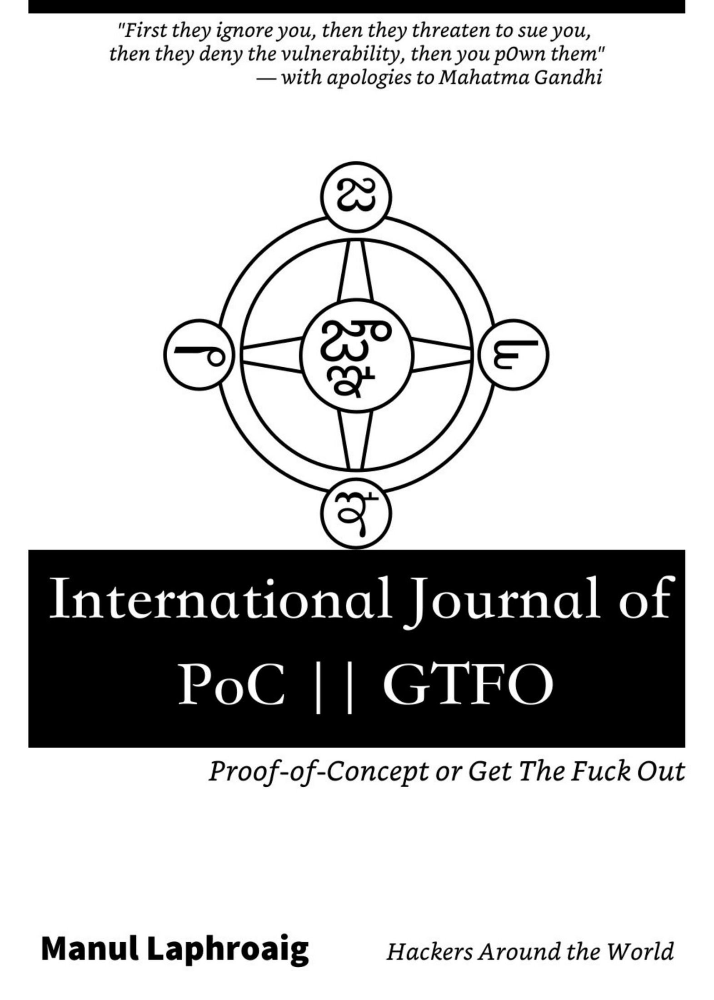
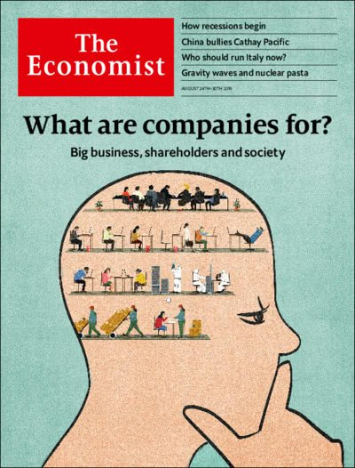

# Know Thyself

## 中文

标题|作者
:-|:-
标题|作者
:-|:-
Mind Hacks|刘未鹏
编程随想: 2009 ~ 2021 Blog Archives|Program Think
晚点 LatePost|宋玮……

---

## 英文

### 博客

标题|作者
:-|:-
Essays of Paul Graham|Paul Graham
Slate Star Codex|Scott Alexander
Astral Codex Ten|Scott Alexander
Vitalik Buterin's website|Vitalik Buterin
The Manuscripts of Edsger W. Dijkstra|Edsger W. Dijkstra
Human Who Codes|Nicholas C. Zakas

其中Vitalik Buterin博客中的数学公式不太好处理，Edsger W. Dijkstra文章也不太好整理。

### 编程教材

标题|作者
:-|:-
The Architecture of Open Source Applications|Amy Brown & Greg Wilson & Tavish Armstrong & Michael DiBernardo
Open Sources: Voices from the Open Source Revolution|Chris DiBona & Sam Ockman & Mark Stone
The Scheme Programming Language|R. Kent Dybvig
CS61A: SICP|John DeNero
Composing Programs|John DeNero
Structure and Interpretation of Computer Programs: JavaScript Edition|Harold Abelson & Gerald Jay Sussman & Martin Henz & Tobias Wrigstad

### 黑客技术

标题|作者
:-|:-
International Journal of PoC or GTFO|Manul Laphroaig
Corelan Cybersecurity Research|Peter Van Eeckhoutte

### 经济学人杂志

