# Know Thyself

## Chinese

Title|Authors|Github
:-|:-|:-
[Mind Hacks](http://mindhacks.cn/)|刘未鹏|[Mind-Hacks](https://github.com/evmn/Mind-Hacks)
[编程随想: 2009 ~ 2021 Blog Archives](https://program-think.blogspot.com)|Program Think|-
[晚点 LatePost](http://latepost.com/)|宋玮……|~~[latepost.com](https://github.com/evmn/latepost.com)~~

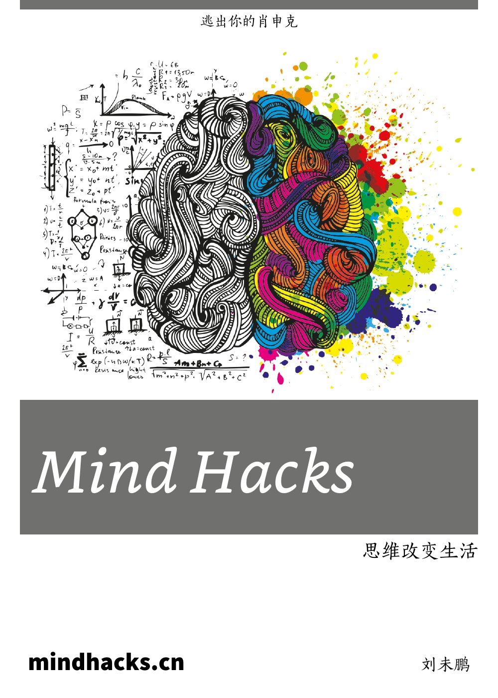
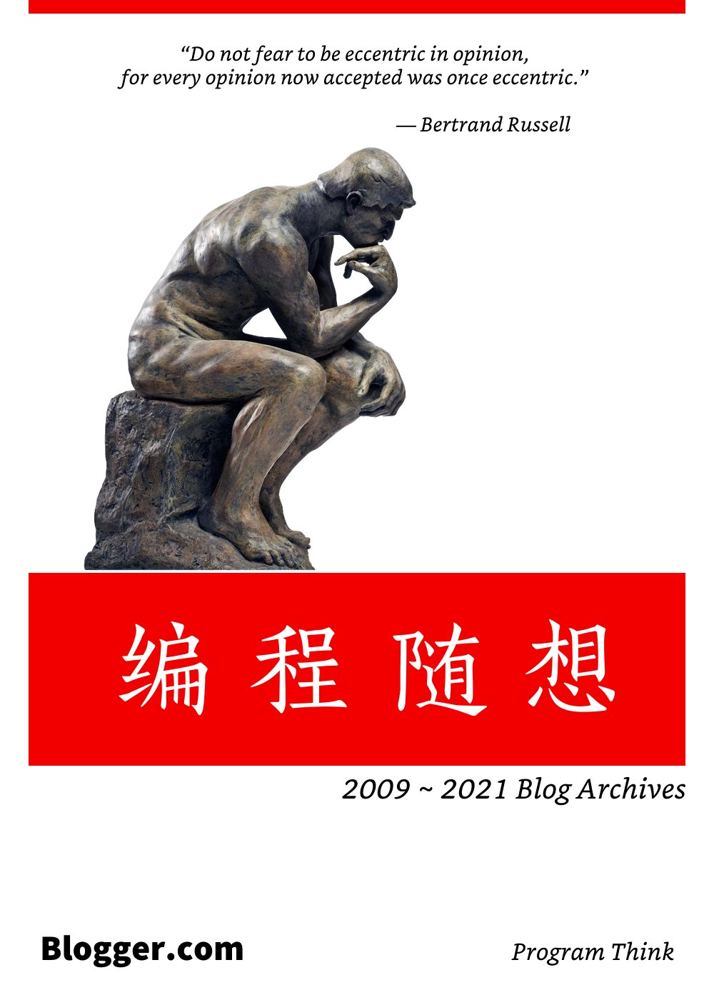

---

## English

### Blogs

Title|Authors|Github
:-|:-|:-
[Essays of Paul Graham](http://paulgraham.com/articles.html)|Paul Graham|[Paul-Graham](https://github.com/evmn/Paul-Graham)
[Slate Star Codex](https://slatestarcodex.com/)|Scott Alexander|[Slate-Star-Codex](https://github.com/evmn/Slate-Star-Codex)
[Astral Codex Ten](https://astralcodexten.substack.com/)|Scott Alexander|[Slate-Star-Codex](https://github.com/evmn/Slate-Star-Codex)
[Vitalik Buterin's website](https://vitalik.ca/)|Vitalik Buterin|TODO
[E. W. Dijkstra Archive](https://www.cs.utexas.edu/users/EWD/)|Edsger W. Dijkstra|[The-Manuscripts-of-Edsger-W.-Dijkstra](https://github.com/evmn/The-Manuscripts-of-Edsger-W.-Dijkstra)
[Human Who Codes](https://humanwhocodes.com/)|Nicholas C. Zakas|[Nicholas-C.-Zakas](https://github.com/evmn/Nicholas-C.-Zakas)

The Math formula in Vitalik Buterin's website is difficult to handle.

Edsger W. Dijkstra's manuscripts is really hard to process properly.

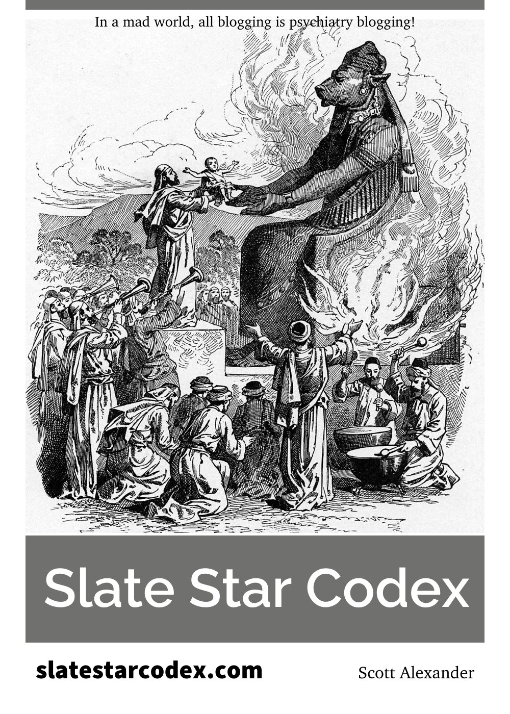
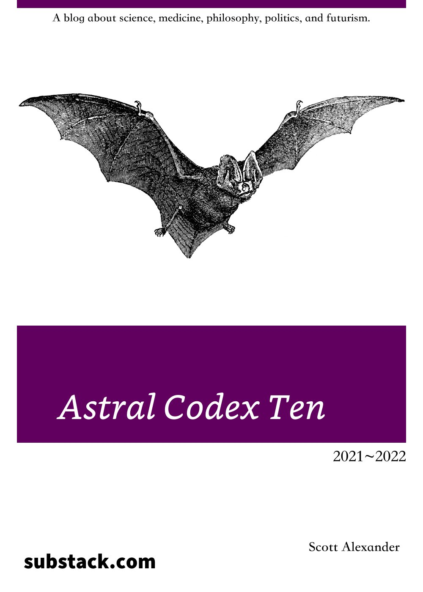
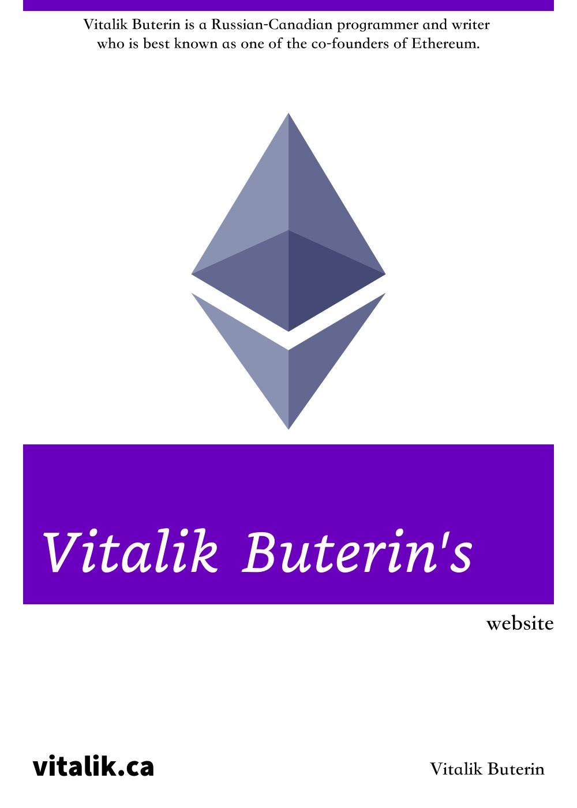

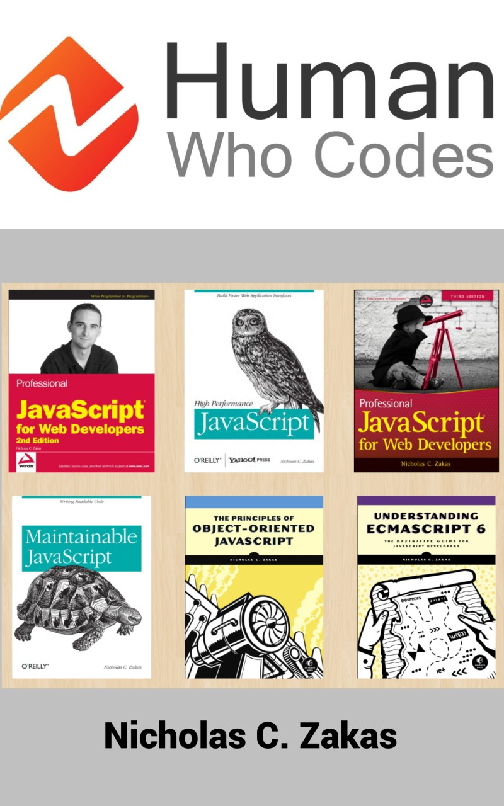

### Programming Textbooks

Title|Authors|Github
:-|:-|:-
[The Architecture of Open Source Applications](http://aosabook.org/en/index.html)|Amy Brown & Greg Wilson & Tavish Armstrong & Michael DiBernardo|[aosabook](https://github.com/evmn/aosabook)
[Open Sources: Voices from the Open Source Revolution](https://www.oreilly.com/openbook/opensources/book/)|Chris DiBona & Sam Ockman & Mark Stone|
[The Scheme Programming Language](https://www.scheme.com/tspl4/)|R. Kent Dybvig|[tspl4](https://github.com/evmn/tspl4)
[CS61A: Online Textbook](https://inst.eecs.berkeley.edu/~cs61a/sp12/book/index.html)|John DeNero|[cs61a](https://github.com/evmn/cs61a)
[Composing Programs](http://www.composingprograms.com/)|John DeNero|[cs61a](https://github.com/evmn/cs61a)
[Structure and Interpretation of Computer Programs: JavaScript Edition](https://sicp.sourceacademy.org/)|Harold Abelson & Gerald Jay Sussman & Martin Henz & Tobias Wrigstad|[source-academy/sicp](https://github.com/source-academy/sicp)

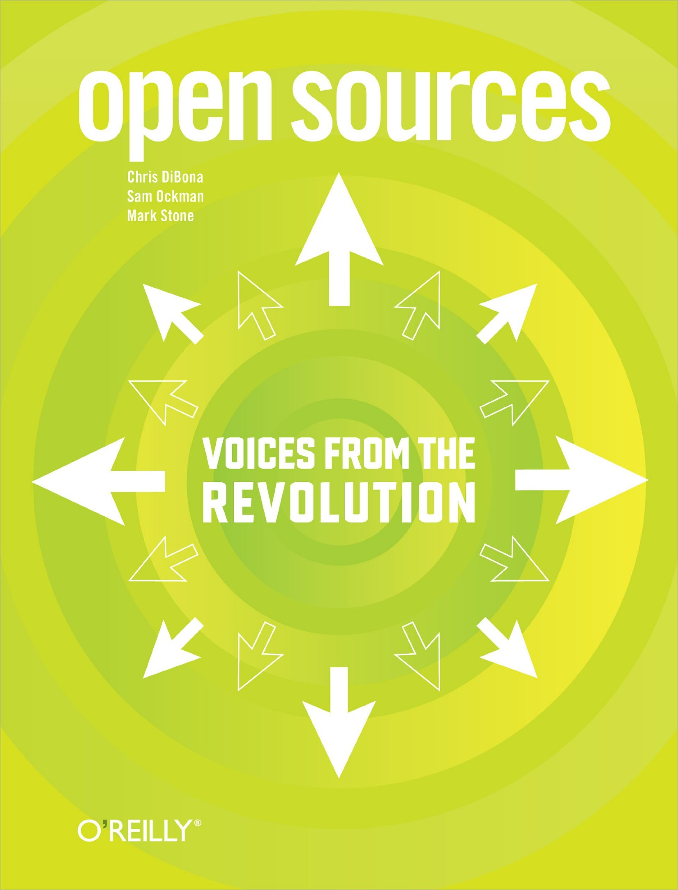
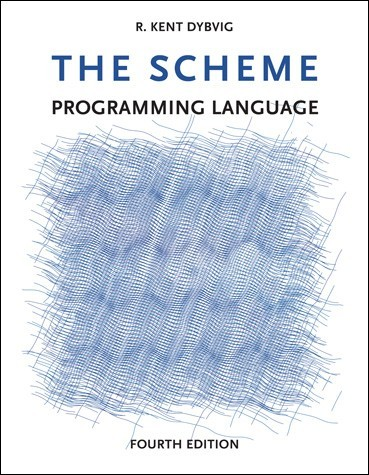
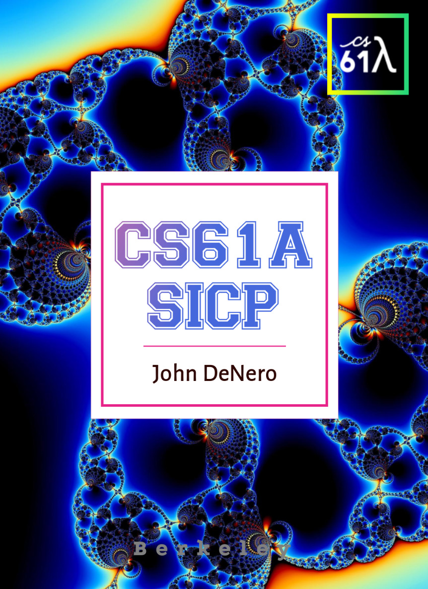
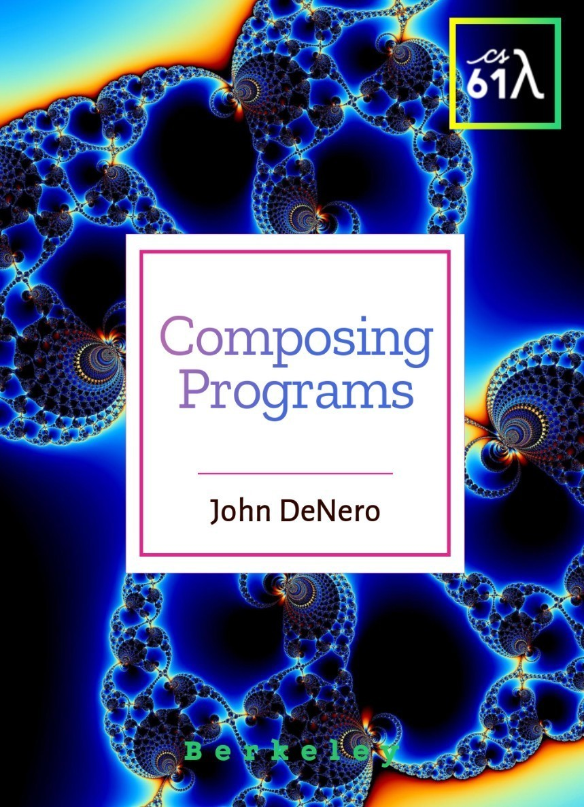
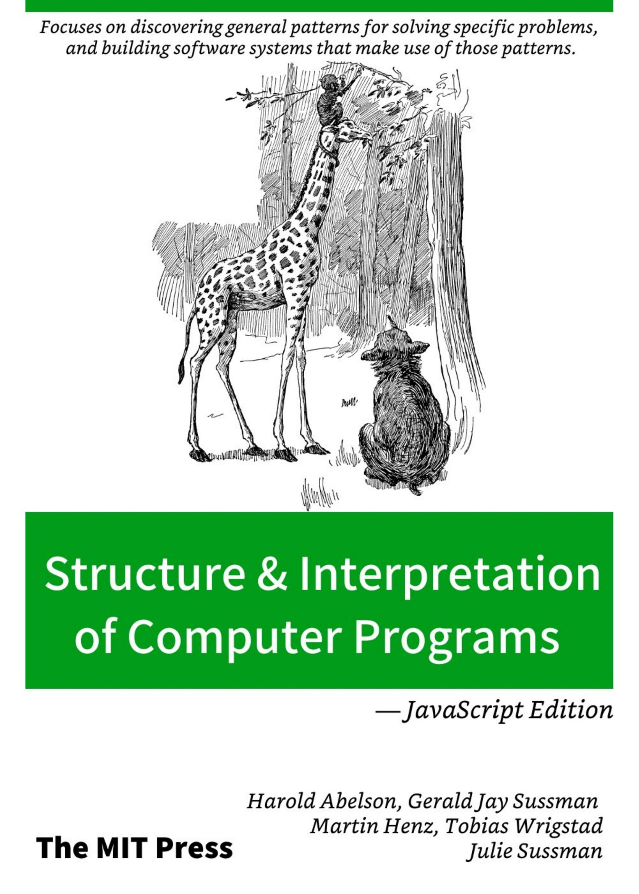

### Hacking

Title|Authors
:-|:-
[International Journal of PoC or GTFO](https://openwall.info/wiki/people/solar/pocorgtfo)|Manul Laphroaig
[Corelan Cybersecurity Research](https://www.corelan.be/index.php/articles/)|Peter Van Eeckhoutte

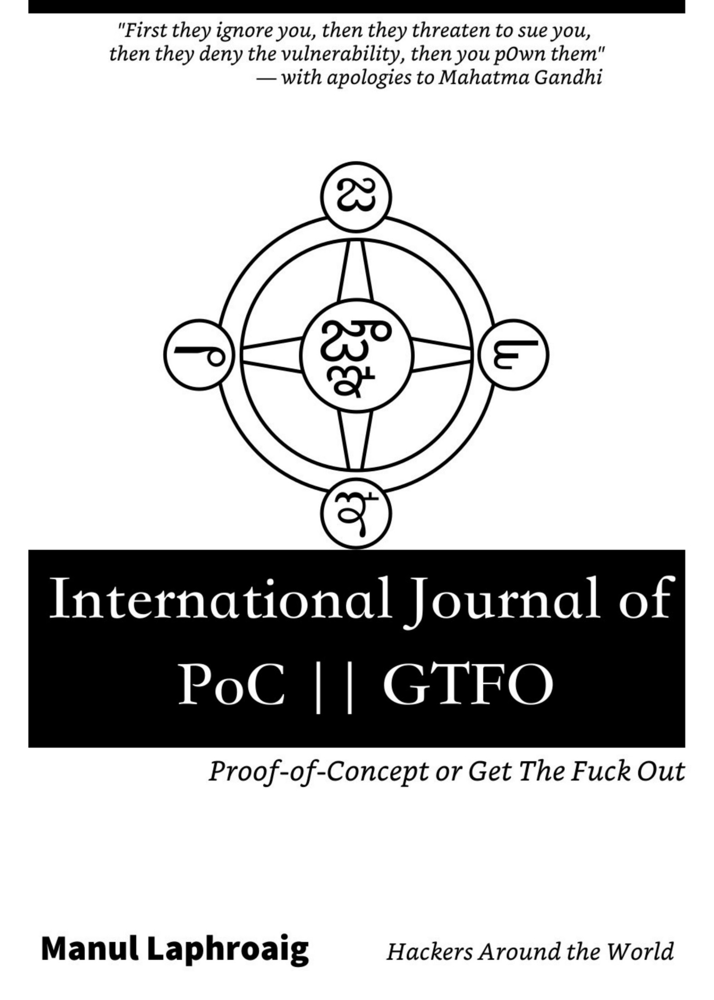
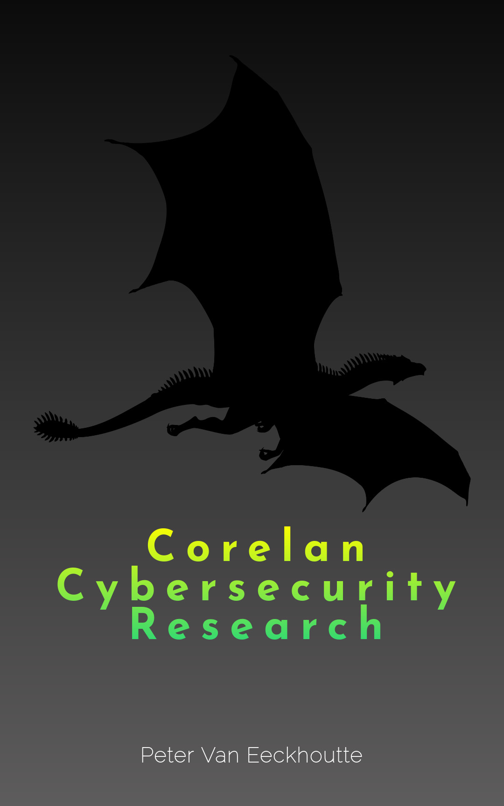

### Health

Title|Authors|Github
:-|:-|:-
[Perfect Sight Without Glasses](https://www.central-fixation.com/perfect-sight-without-glasses/)|William H. Bates|-
[Webvision: The Organization of the Retina and Visual System](https://webvision.med.utah.edu/)|Helga Kolb & Ralph Nelson & Eduardo Fernandez & Bryan Jones|gist[Webvision.py](https://gist.github.com/evmn/e6608696a8e3a8724987f6fab534f2d6)

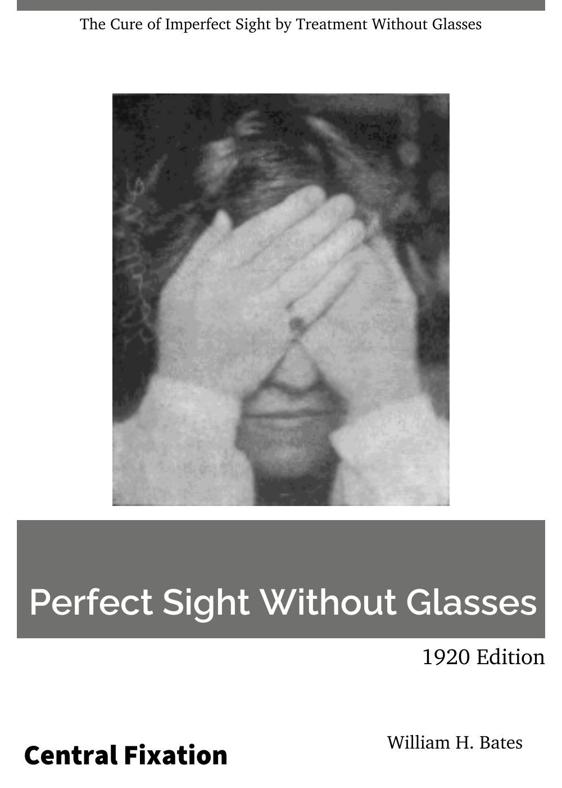
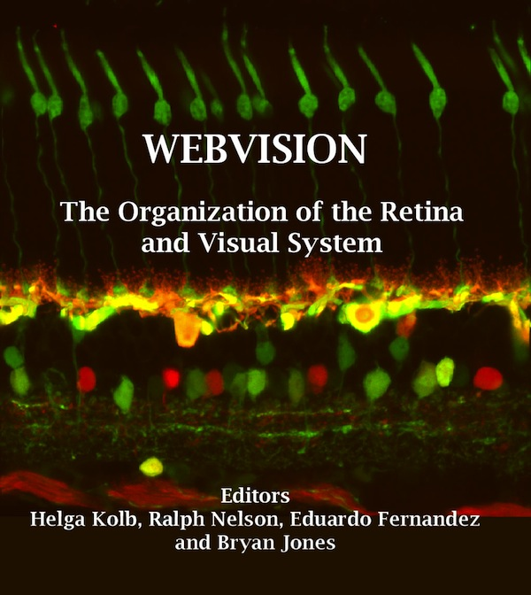

Other books or website:

Title|Author
:-|:-
[Myopia Manual - 2022 Edition](http://www.myopia-manual.de/)|Klaus Schmid
NCBI Version [Webvision: The Organization of the Retina and Visual System](https://www.ncbi.nlm.nih.gov/books/NBK11530/)|Helga Kolb & Ralph Nelson & Eduardo Fernandez & Bryan Jones

### Magzine

Title|Github
:-|:-
[The Economist](https://www.economist.com/weeklyedition/archive)|[the-economist](https://github.com/evmn/the-economist)

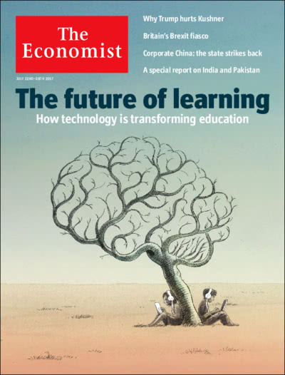
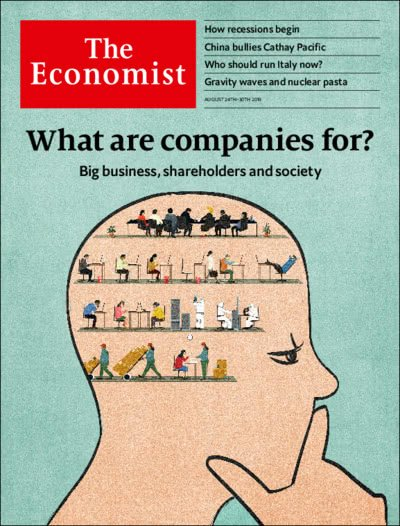

